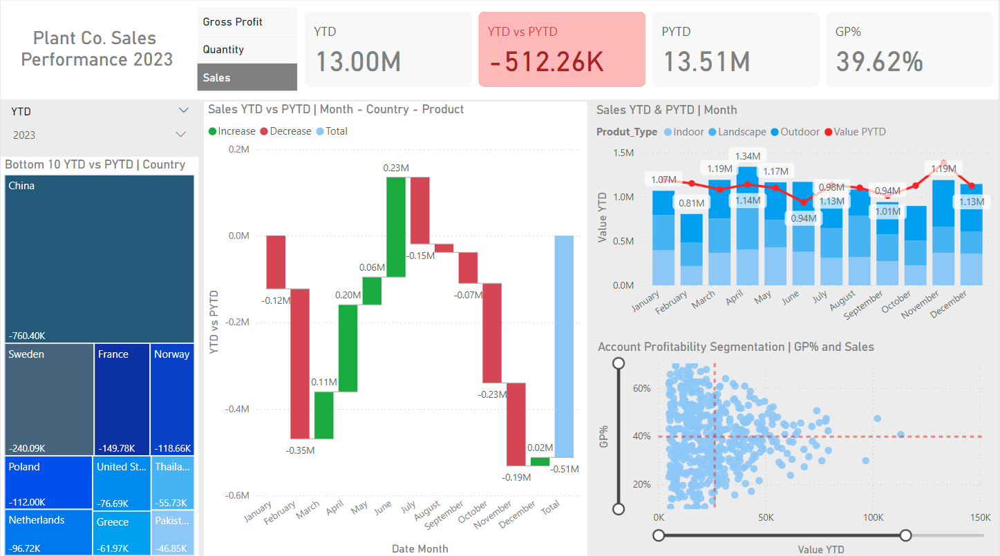

# Plant Co. Performance Analysis on PowerBI

Analysing the performance of a example gardening store dataset using PowerBI. To explore the interactive dashboard, download the PowerBI (.pbix) file above!

## North Star Metrics, KPIs & Dimensions
**Sales:** Total revenue generated among indoor, outdoor, and landscape products

**Quantity:** Total quantity of items sold among indoor, outdoor, and landscape products

**Gross Profit:** Total amount of profit generated among indoor, outdoor, and landscape products

**Product Type:** Indoor, Outdoor, and Landscape

## Summary of Insights
**Sales:** 
- Total sales across 2023 and 2024 have been decreasing compared to their previous year=to-date, with Feb. 2023 being the month with the least amount of sales.
- Apr. 2023 and Feb. 2024 saw the biggest increases in sales, outperforming their previous years' sales performance by a significant margin. Investigate to see what can be done to replicate these performance results.
In 2023, China and Sweden saw by far the biggest sales loss compared to the previous year, seeing a combined sales decline of $1.1 million compared to the previous year-to=date.

**Quantity:** 
- 2023 showed a increased in quantity of items sold compared to the previous year-to-date, with Mar.-Jun. 2023 showing a large increase in quantity of items sold.
- 2024 showed a decrease in quantity of items sold compared to the previous year-to-date.

**Gross Profit:** 
- Both 2023 and 2024 show a loss in profit compared to the previous year-to-date. This combined with the increase in quantity of items sold suggests that some items are being sold at a loss to the company.
- China is by far the least profitable country, contributing to a profit loss of $403 thousand compared to the previous year to date.

## Recommendations & Next Steps
- Investigate which items are being sold at a loss to the company and see what can be done to increase profit margins. Can we sell these items at a loss to push customers to buy more profitable items, or should we raise the price on these items?

- Investigate sales in China to see what can be done to increase sales in that region.
